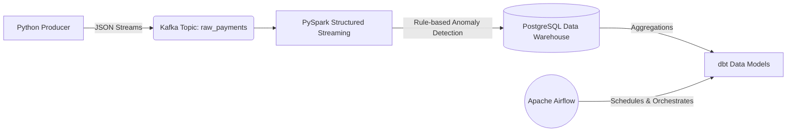

<div align="center">
  <h1>🛡️ VelocityGuard</h1>
  <p><b>An End-to-End Real-Time Fraud Detection Data Pipeline</b></p>
  <p>
    
    
    
    
    
    
    
  </p>
</div>

---

## ⚡ Overview

**VelocityGuard** is a fully containerized, real-time data engineering pipeline designed to ingest, process, and model financial transactions to detect fraudulent activity as it happens. Built with a modern data stack, this project demonstrates how to orchestrate high-throughput streaming data and transform it into actionable business intelligence.

Whether it's a massive transaction anomaly or a rapid sequence of suspicious micro-transactions, VelocityGuard catches it in real-time, stores the flagged records securely, and builds analytical summaries for downstream dashboards.

---

## 🏗️ Architecture



### How the Magic Happens:
1. **Data Ingestion (`producer.py`)**: A Python script acts as a mock financial system, continuously pumping JSON transaction data (including location, amount, and user IDs) into a local Kafka cluster.
2. **Stream Processing (`spark_processor.py`)**: A PySpark Structured Streaming job consumes the Kafka topic. It applies sliding watermarks and real-time business logic to flag transactions as fraudulent (e.g., amounts > $5,000 or high transaction velocity within a 1-minute window).
3. **Storage**: Flagged and clean transactions are appended to a `processed_payments` table inside a PostgreSQL database.
4. **Data Modeling (dbt)**: `dbt-postgres` is used to build robust, modular SQL transformations that aggregate the raw stream into a `daily_fraud_summary` view.
5. **Orchestration (Airflow)**: An Apache Airflow DAG schedules and triggers the dbt transformations on a daily cadence, ensuring business stakeholders always have up-to-date metrics.

---

## 🚀 Getting Started

### Prerequisites
- **Docker & Docker Compose** (Ensure the daemon is running)
- **Python 3.10+** (Tested natively on Arch Linux)
- **Git**

### 1. Clone the Repository
```bash
git clone https://github.com/abhijeeth12/VelocityGuard.git
cd VelocityGuard
```

### 2. Set Up the Python Environment
To prevent dependency conflicts (and respect PEP 668 on systems like Arch Linux), set up a local virtual environment:
```bash
python -m venv venv
source venv/bin/activate
pip install -r requirements.txt
```

### 3. Spin Up the Infrastructure
Boot up Kafka, Zookeeper, PostgreSQL, and Apache Airflow using Docker Compose:
```bash
docker compose up -d
```
*(Note: It may take a minute or two for all containers to pull and initialize. You can check the status via `docker ps`)*

---

## 🏃‍♂️ Running the Pipeline

You'll need a few separate terminal tabs (make sure to activate your virtual environment `source venv/bin/activate` in each!).

#### Terminal 1: Fire up the Data Generator
Start pumping mock financial transactions into the Kafka topic:
```bash
python producer.py
```

#### Terminal 2: Start the Fraud Detection Engine
Launch the PySpark streaming job to process the data in real-time and write it to Postgres:
```bash
python spark_processor.py
```

#### Terminal 3: Test Data Transformations (dbt)
Run the SQL transformations manually to generate the daily fraud aggregates:
```bash
cd fraud_models
dbt run --profiles-dir .
```

### 🕸️ Accessing Airflow
Head over to `http://localhost:8080` in your browser.
- **Username**: `admin`
- **Password**: `admin`

You'll see the `fraud_dbt_dag` ready to be unpaused. This DAG automatically runs the dbt transformations on a daily schedule.

---

## 🛠️ Tech Stack Deep Dive
- **Infrastructure**: Docker Compose handles the heavy lifting, containerizing the message broker, database, and orchestration engine.
- **Ingestion**: `kafka-python` delivers lightweight, high-throughput message publishing.
- **Processing**: `pyspark` (Structured Streaming) provides fault-tolerant, scalable stream processing with exactly-once semantics.
- **Transformation**: `dbt` (Data Build Tool) brings software engineering best practices (modularity, testing, version control) to SQL data modeling.
- **Orchestration**: Apache Airflow manages complex dependencies and schedules the batch modeling workloads.

---

<div align="center">
  <i>Built with ❤️ by Abhijeeth</i>
</div>
